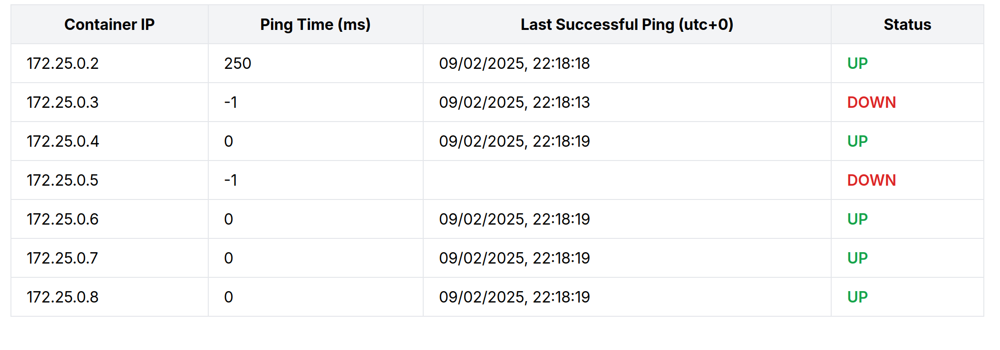

# Профильное задание

### Запуск

```bash
docker compose build
docker compose up
```

[http://localhost:8080](http://localhost:8080)

### Функционал



Сервис с определенным интервалом пингует docker-контейнеры на машине и показывает их состояние (ip, ping time, last successful ping date, status). Данные о состоянии контейнеров сохраняются в БД postgres.

**Переменные среды**  
установлены в `.env`
| Переменная | Назначение |
| --- | --- |
| APP_PORT | порт, на котором приложение принимает запросы (default: 8080) |
| BACKEND_PORT | порт, на котором сервис backend принимает запросы (default: 8091) |
| PING_PERIOD_SEC | Сервис пингует docker-контейнеры раз в столько секунд (default: 1) | 
